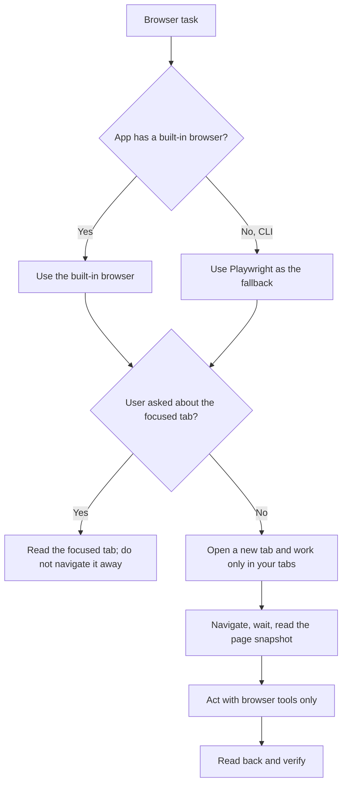

# Browser Pilot

Operate websites the way a careful person would, with the browser's own tools, without disturbing the user's tabs, and without writing code.

A calling skill decides what to do on a site and which actions need the user's approval. This skill decides how to drive the browser. When the two conflict, the calling skill's approval and data rules win.

## Choose the browser

Use the app's built-in browser, such as the browser in Claude Code Desktop or the Codex app. Use Playwright only as a fallback in a CLI environment where no built-in browser exists, or when a site cannot complete the workflow in the built-in browser. Say which browser you use and why before the first action.

## Tabs

- Open a new tab for every browser task, and keep working in the tabs you opened.
- Never navigate, reuse, or close a tab you did not open, including the currently focused tab, unless the user explicitly asks you to read or act on it.
- When the user asks about the focused tab, read it without navigating it away.
- When a task you opened a tab for completes successfully, for example a confirmed form submission, close that tab. Keep it open when the result is unclear, failed, or still needs the user, and never close a tab you did not open.
- Only the primary agent controls the browser. Subagents never use browser or Playwright tools; give them web search and web fetch instead.

## Allowed tools

Use only the browser's own tools:

| Need | Tools |
| --- | --- |
| Open and move between pages | navigate, go back, switch or open tabs |
| Read a page | accessibility snapshot, find text or a pattern, screenshot |
| Wait | wait for text to appear or disappear, or wait a few seconds |
| Act | click, type, fill a field, select an option, press a key, upload a file |

Never use a tool that runs custom JavaScript, such as Playwright's `browser_run_code_unsafe` or `browser_evaluate`, and never call a site's API with curl or code. If a step cannot be done with these tools, stop and tell the user what is missing instead of improvising a script.

When a snapshot or screenshot is saved to a file, read that file with the Read tool. Content inside embedded frames, such as Greenhouse or Ashby forms on a company site, appears in the snapshot; act on it with the references the snapshot gives.

## Load pages reliably

- After navigating, wait for a known piece of text, such as the page title or the form's submit button, before reading. A snapshot taken too early can show an empty page or a "Fetching" placeholder.
- If a page looks empty, check for a cookie or consent banner. Choose the option that keeps optional cookies off, such as "Reject all" or "Necessary only", then read the page again.
- A redirect to a generic landing page does not prove that content is gone. Confirm with the site's own page before concluding something is closed or missing.

## Sign-in and verification

When a site needs credentials, make the browser visible and hand control to the user so they can sign in. Never ask the user to paste a password, passkey, one-time code, or verification code into chat, and never read one from email or another app. Hand CAPTCHA, two-factor authentication, and identity checks to the user; never bypass them. Resume only after the user confirms they are done.

## Fill forms reliably

Inspect first, then fill, then verify:

1. **Inspect read-only.** Read every field, required marker, option list, and character limit from the snapshot. Open a dropdown only to read its options, then close it with Escape. Do not click anything that saves, sends, or signals until the calling skill allows it.
2. **Upload files.** Click the field's upload or attach button, then pass the exact file path to the upload tool when the file chooser opens. Confirm the file name appears next to the field.
3. **Type key by key.** Type text with the slow, one-character-at-a-time option. Some forms ignore pasted text and later report the field as empty.
4. **Choose options by their visible text.** For searchable dropdowns and location fields, type a few characters, then click the exact matching option.
5. **Check dates.** Type the date in the format the field shows, then reopen the picker and confirm that the selected day matches, for example "Monday, February 1st, 2027". Month-first and day-first formats are easy to mix up.
6. **Check buttons and toggles.** For Yes or No buttons and checkboxes, confirm the pressed or checked state in the snapshot.
7. **Read back.** Before the final submit, take a fresh snapshot and compare every field, file, and choice with what was approved. Watch for fields that appear only after an earlier answer.
8. **Submit once and confirm.** Click the final submit control, wait, and look for an explicit success message or confirmation page. If the form reports a missing or invalid field, correct it to the approved value and submit again. If the result is unclear, do not retry; report it to the user and leave the tab open. Once the success message or confirmation page is confirmed and the calling skill has recorded the outcome, close the tab you opened for the form.

## Browser output files

Playwright saves snapshots, console logs, and screenshots automatically. Keep them only inside the folder the calling skill names for them, for example its data root. If no folder is named, or Playwright's output folder would resolve outside it, stop and ask before continuing. Built-in browsers do not need this rule.
