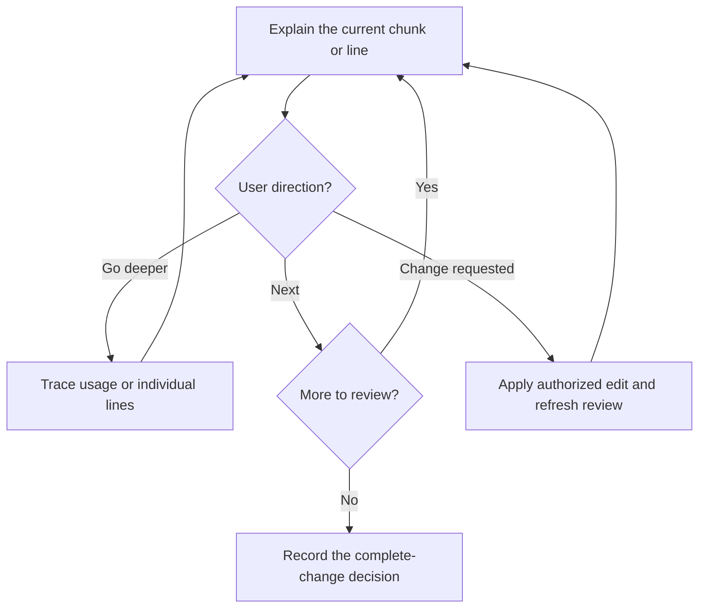

# Guided Code Review

Explain the change so the user can question it and decide. [Spec Workflow](../spec-workflow/SKILL.md) owns implementation and integration; this skill owns the conversation and its review record. Stay in the current conversation. A standalone local/PR review does not require creating a workflow hierarchy.

## Establish the comparison

Verify the requested diff and its exact base/head/spec inputs. Inspect the whole change internally, including callers, contracts, tests, new/deleted files, and relevant mode changes. Distinguish inherited parent work, previously approved descendants, and new or subsequently modified changes.

For coordinated work, identify the shared branch name, repository members and paths, and review scope: **spec acceptance, one member, coordinated integration, or final release**. A spec review can precede code; it does not approve that implementation. Code-only work needs no invented spec counterpart. A preview may discuss incomplete work without declaring it ready to integrate.

For a hard-sync repair, include its finding and user disposition plus the scoped [breaking-mode permission](../spec-workflow/references/hard-sync.md#breaking-mode), if any. Explain affected APIs, consumers, schema/data expectations, and why migrations are present or omitted. A breaking-change flag is not feature-removal or merge approval.

Open the matching diff and provide verified source/line links when possible. If the live checkout differs, use the frozen snapshot rather than presenting current lines as the reviewed commit. Do not publish PR comments or create external artifacts merely because this resembles a PR review.

## One chunk, then a pause

Start with the purpose, exact comparison, and a short chunk map; explain the first chunk immediately. A chunk is one meaningful decision or behavior, possibly connecting a spec, contract, backend caller, frontend use, and tests. Follow the behavior/data path rather than file order, and account for the complete diff and required participants.

For the current chunk, explain:

- **What changed:** a small before/after example with source links.
- **Why:** the requirement, defect, or tradeoff; separate evidence from inferred historical rationale.
- **How it is used:** real callers, data movement, side effects, and relevant failure paths.
- **How to judge it:** simpler alternatives, checks actually run, and unresolved questions.

For a domain-related chunk, check the [domain mapping](../spec-workflow/SKILL.md#map-domain-language-into-code). Show how the spec term maps to the actual model, storage, and contract names and how its relationships/invariants are represented. Flag unexplained synonyms or missing links; use a compact table or model diagram when it clarifies the mapping.

Use a small grounded Mermaid diagram when it helps: call hierarchy for usage, sequence diagram for ordering, data-flow diagram for transformations, or state/flowchart for lifecycle choices. Label actual calls, payloads, and failure paths; mark unverified edges. Do not invent a call graph, defend unnecessary complexity, or force a diagram onto a trivial rename. Check changed diagrams where tooling allows and do not claim unverified rendering.

**After one chunk, end the response and wait.** Do not explain the whole diff at once or treat silence as agreement. Adapt the detail to the user and retain the cursor through questions.

| Direction | Effect |
| --- | --- |
| Next / continue | Advance one line in line mode or one chunk in chunk mode; never imply merge approval |
| Why / show callers / what if it fails | Stay on this chunk and explain the requested path |
| Line by line | Explain each changed line or tightly coupled group, waiting between steps |
| Looks good / approve this chunk | Acknowledge only the scope currently discussed |
| Change this | Suspend review, perform only the requested edit through the active workflow (or directly for a standalone request), and refresh affected review |
| Skip / pause | Record skipped scope or save the cursor; neither is approval |
| Approve this change for the named destination | Record that exact decision; recognize an explicit waiver if the user intentionally skips remaining review |

A question about an alternative is not an edit request. New behavior or shared terminology missing from specs follows the [spec guardrail](../spec-workflow/SKILL.md#when-to-return-to-specs); preserve existing code and pause dependent integration. Do not silently fix code during explanation or rewrite specs to justify it.

## Review record

Use the workflow's existing ledger, or conversation state for a standalone read-only review:

| Record | Content |
| --- | --- |
| Identity and scope | Shared change name, participants/unaffected evidence, purpose, destinations; hard-sync finding/decision and breaking permission when used |
| Versions | Per-repository parent/base, child/head, accepted spec SHAs, relevant checks and currentness |
| Progress | Stable chunk IDs, paths/hunks, discussed/accepted/skipped/needs-change status, current line/chunk, questions and edits |
| Decision | Spec accepted, changes requested, paused/rejected/deferred, walkthrough complete, or exact integration approved; include explicit waivers |

After edits, rebases, or unexpected peer/spec changes, regenerate affected chunks and stale the previous merge decision. Preserve useful discussion of unchanged code, but obtain a decision covering the current versions. Expected source-to-squash transitions within an approved batch are handled by [Git operations](../spec-workflow/references/git-operations.md#squash-into-the-immediate-parent); do not re-ask for the same valid approval.

When coverage is complete or explicitly waived, briefly recap scope, open issues, checks, and limitations. **Walkthrough complete is not merge approved.** Recognize clear approval of the concrete whole-change proposal without asking twice. Return the record to Spec Workflow; it checks integration eligibility and performs only the authorized action. A member approval does not approve its peers, ancestors, or final release. Preserve the user's review cursor until they explicitly move on.
