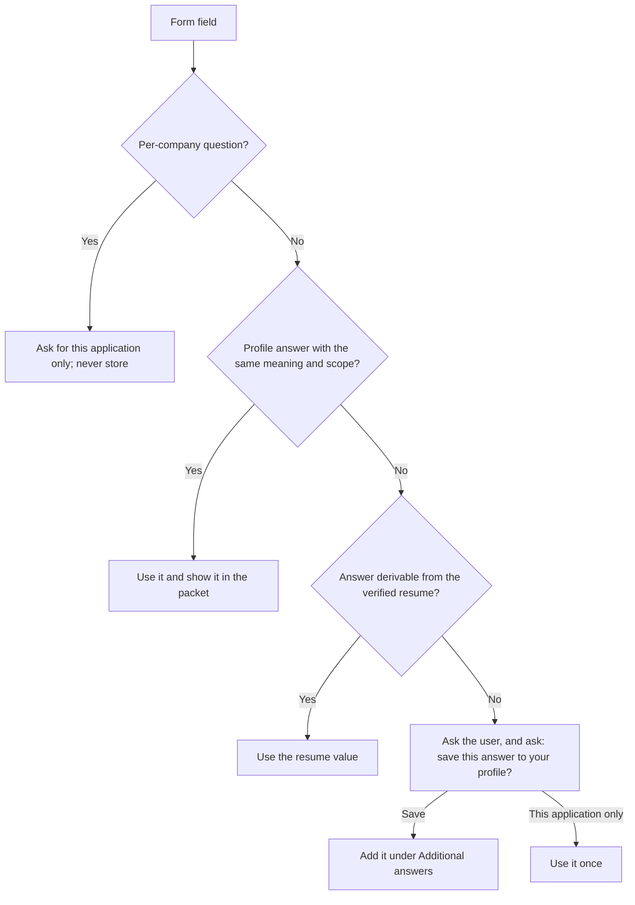

# Applicant profile

Read this file when the skill is invoked for any application work, and before inspecting an application form.

Application forms keep asking the same personal questions: work permit, notice period, salary, demographics, consents. The user answers each one once in a private profile file, and the skill reuses those answers on every application.

## The profile file

- Path: <home-directory>/jobhunt/applicant-profile.md, next to tracker.csv.
- It holds the user's personal answers. Never commit it, copy it into this skill or any repository, upload it, paste it into a research file or cover letter, or send it to a subagent. Share only the single answer a form field needs, after the submit approval.
- Read and change it only with the Read, Edit, and Write tools. Create it with the Write tool the first time the questionnaire runs.
- The user owns it. Change an answer only when the user gives or confirms the new value.

Write one section per question ID from the catalog below, in the same order:

```markdown
## NOTICE-PERIOD
Answer: <the user's answer>
How to apply: <optional, e.g. which option to pick when a form offers ranges>
Updated: <YYYY-MM-DD>
```

"How to apply" is optional and only explains how to map the answer onto different form wordings. Questions the user adds during applications go under a final `## Additional answers` heading in the same shape, with the form's wording as the heading.

## One-off questionnaire

On the first application work in a session:

1. Read the profile file. If it is missing, treat every question as unanswered.
2. Compare it with the catalog. A question is unanswered when its ID has no section or an empty Answer.
3. If any are unanswered, ask all of them in one numbered message before continuing. Show each question's choices, and allow "prefer not to say" for any demographic or optional question.
4. Write every answer into the profile, re-read it, and continue the user's request.

Never ask an answered catalog question again. When the user maintains this catalog and adds a question, the next run asks only that new one.

## Using answers on a form



- Use an answer only when the field has the same meaning and scope. For example, a German work-permit answer does not answer a US work-authorization question.
- When a question is not in the profile, ask for the answer together with "save it to your profile?". Do not propose changing this skill or its catalog for new questions; the user maintains the catalog.
- Profile answers never replace the submit approval for a named role. Every value still appears in the application packet.

## Question catalog

### Work authorization and location

| ID | Question |
| --- | --- |
| WORK-PERMIT-DE | Are you authorized to work in Germany, and with which permit? |
| SPONSORSHIP | Do you need visa sponsorship now or in the future for Germany? |
| WORK-AUTH-OTHER | Are you authorized to work in other countries, such as other EU countries, the UK, or the US? |
| US-PERSON | Are you a "U.S. person" (US citizen, green-card holder, refugee, or asylee)? |
| SANCTIONS | Are you a citizen, national, or resident of an embargoed or sanctioned country, such as Iran, Cuba, North Korea, or Syria? |
| NATIONALITY | Your citizenship(s), or "prefer not to say" when a form asks for diversity reporting |
| RESIDENCE | Which city and country do you live in? |
| RELOCATION | Which cities or countries would you relocate to, if any? |
| WORK-MODE | Do you accept hybrid, fully onsite, or remote-only roles? |
| ON-CALL | Do you accept on-call duty, including weekends? |

### Availability and pay

| ID | Question |
| --- | --- |
| NOTICE-PERIOD | What is your notice period? |
| START-DATE | What is your earliest start date? |
| SALARY | Desired annual gross salary: your minimum, the single number for exact fields, and the currency |
| SALARY-BASE-VS-TOTAL | When a form separates base salary from total compensation, what do you answer for each? |
| CURRENT-SALARY | Do you disclose your current salary, and if so, what is it? |
| NON-COMPETE | Are you bound by a non-compete or similar restriction? |

### Personal and legal

| ID | Question |
| --- | --- |
| LEGAL-NAME | Your legal first and last name as on official ID, in Latin characters |
| PREFERRED-NAME | The first name you prefer to be called |
| PRONOUNS | Your pronouns, or "prefer not to say" |
| GENDER | Gender for diversity forms, or "prefer not to say" |
| AGE-RANGE | Age range for diversity forms, or "prefer not to say" |
| DISABILITY | Disability status for diversity forms, or "prefer not to say" |
| CRIMINAL-RECORD | Do you have a criminal record or pending charges? |
| BACKGROUND-CHECK | Do you consent to a background check or police clearance certificate when an employer requires one? |

### Profiles and languages

| ID | Question |
| --- | --- |
| GITHUB | Your GitHub profile URL, or none |
| WEBSITE | Your personal website or portfolio URL, or none |
| LANGUAGES | Each language you speak with its level (native, or CEFR A1 to C2) |

### Consents and preferences

| ID | Question |
| --- | --- |
| AI-SCREENING | Do you accept the employer's AI-assisted screening of your application? |
| INTERVIEW-RECORDING | Do you consent to interviews being recorded or AI-transcribed? |
| OPTIONAL-CONSENTS | Text-message updates, marketing, talent pools, and future-opportunity retention: opt in or out? |
| REQUIRED-CONSENTS | May the skill agree to a data-processing consent that is required to submit the application? |
| HOW-HEARD | What do you answer to "How did you hear about this job?" |

## Not stored in the profile

- Contact details: name, email, LinkedIn URL, and residence come from the verified resume. The phone number comes from the user once per session when the resume has none; see application-gates.md.
- Per-company facts: whether you previously applied to, interviewed with, or worked for this employer or its auditor, referrer names, and cooldowns. Answer these from the resume, the tracker, and research, and ask when they are ambiguous.
