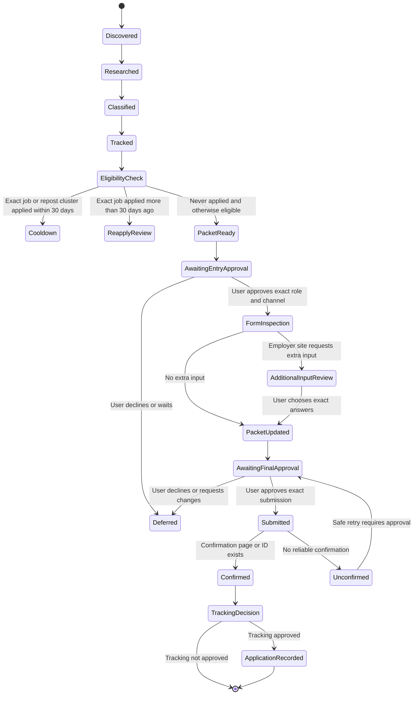
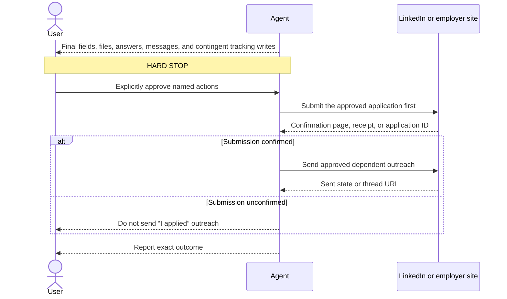

# Application preparation and approval gates

Read this file before opening an application flow or sending an application-related message.

## State model



## Confirm eligibility first

Before preparing an application, read the live row and follow [discovery-tracking.md](discovery-tracking.md):

- Resolve the canonical LinkedIn URL and any repost relationship recorded in the private ledger or company Markdown.
- Verify the official posting is still open and materially matches the researched role.
- Exclude confirmed applications in the same repost cluster during the previous 30 calendar days.
- Never auto-reapply to an exact LinkedIn URL that has a `Last Applied` date. An older exact application requires a specific reapply decision.
- Reconcile any mismatch between LinkedIn's `Applied` badge and the tracker before continuing.

If a redirect opens a different role, stop and research and track the new identity before using this workflow.

## Prepare the decision packet

Before the first application gate, show:

- Company, role, location, job URL, job ID, posting date, and application channel.
- Concise company research with sources, salary evidence, interview expectations, and risk flags.
- Fit assessment: `A — Great Fit`, `B — Normal Fit`, `Investigate`, or `Skip`, with evidence-backed rationale, strongest evidence, gaps, hard constraints, and a recommendation.
- Exact provided PDF filename, absolute path, SHA-256 hash, page count, and modification time.
- Read-only role-alignment summary based only on the provided PDF: central qualifications evidenced, unsupported gaps, and any parsing problem that could affect this application. Do not propose or make resume changes.
- Proposed cover letter or note.
- Proposed LinkedIn Premium actions, why they help, and any credit or quota they consume.
- Active account, relevant visibility mode, and exact execution order.
- Post-submit tracking preview: canonical LinkedIn URL, target CSV row, the exact fit-preserving `Status` such as `A — Great Fit · Applied`, and `Last Applied`. Use `${submitted_at}` only until the site confirms the real date.
- Known questions that require user input.

Ask permission to enter that exact application workflow. Do not click `Apply`, `Easy Apply`, or an employer-site equivalent before approval when doing so may create a saved application or share applicant data.

## Inspect and draft

After entry approval, inspect the entire form and prepare answers without submitting. Reuse verified user data only when its source and currentness are known. Show every exact submitted value in the final packet. Ask for anything sensitive or uncertain.

### Handle employer-site additional inputs

When LinkedIn redirects to an employer career site, or an employer site asks for input beyond verified contact details and the selected resume, pause before entering it. This includes cover letters, motivation statements, experience summaries, role-specific questions, portfolio or writing-sample requests, additional documents, and optional free-text fields.

Inspect all visible pages or steps first when possible, then present the additional inputs together. For each input show:

- The exact field label, whether it is required, its format, and any character or file limits.
- Two or three materially different choices when useful. Put the recommended choice first and explain the tradeoff briefly.
- The exact optimal draft for every text choice, grounded in the verified resume, job description, and company research.
- Any unsupported claim, missing fact, or answer that requires the user rather than optimization.
- A `Leave blank` choice only when the field is optional and omitting it is reasonable.

Use this compact pattern:

```text
Field: Why do you want to join Acme? (required, 1,000 characters)

A — Tailored and specific (Recommended)
<exact draft>

B — Concise
<exact draft>

Reply: A, B, or revise: <instruction>
```

For a cover letter, normally offer:

1. A tailored role-specific letter as the recommended option.
2. A shorter direct version when the company or form favors brevity.
3. `Do not include` only when the letter is optional.

Keep every draft truthful and evidence-backed. Prefer concrete matching experience, why the role and company are relevant, and a short close. Do not invent enthusiasm, metrics, responsibilities, relationships, or company knowledge.

If several fields are visible, the user may select them individually or approve `all recommended choices`. This selects draft content only; it does not authorize submission. Do not type or upload the selected content until the applicable entry or upload action is approved. Include all selected content again in the final submission packet.

For sensitive or factual fields listed below, do not recommend an answer merely to improve application odds. Show the available choices, identify what each means, and ask the user to supply or confirm the fact. If a later page reveals another substantive field, pause and repeat this process before continuing.

Do not infer:

- Work authorization or sponsorship needs.
- Salary expectations or current compensation.
- Willingness to relocate or commute.
- Notice period or availability.
- Demographic, disability, veteran, or criminal-history answers.
- Consent to future opportunities, marketing, automated screening, or talent pools.
- Legal or preferred name, pronouns, birth date, citizenship, nationality, address, phone, or email.
- Security clearance, background-check consent, conflicts, non-competes, references, or credentials.

Hand CAPTCHA, passkeys, two-factor authentication, and identity verification to the user. Do not bypass them.

## Use LinkedIn Premium deliberately

Check which features are actually visible in the current plan and region. Before visiting a named recruiter, manager, or employee profile, inspect LinkedIn’s profile-viewing mode. If the visit would identify the user, obtain approval either to make that visible visit or to switch to private mode. Use Premium features as follows:

- **Applicant and company insights:** prioritize and tailor; never treat a match score as a hiring verdict.
- **Top Applicant:** use as a lead, not proof of qualification.
- **Career Insights and Actively Hiring:** identify current demand and the most relevant recruiter or manager.
- **Network paths:** prefer a genuine warm introduction over cold outreach.
- **Top Choice:** propose it only for a truly high-priority, well-matched role; include the exact note in the approval packet.
- **InMail:** reserve it for a named, relevant recipient when no better route exists; include recipient, subject, body, credit cost, and remaining balance in the approval packet.
- **Who viewed the profile:** use as a private prioritization signal; never tell someone they were observed viewing the profile.
- **Interview practice and Learning:** close a demonstrated gap and rehearse role-specific stories; do not collect certificates as a substitute for evidence.

Draft messages that are short, specific, truthful, and easy to answer. Do not contact several people on one team with the same pitch. Do not send a follow-up without its own approval unless the user explicitly approved that exact follow-up in advance.

Any profile change, Open Profile setting change, company-interest signal, follow, connection request, InMail, referral request, or Top Choice selection is an external action. Show it and get approval first.

Do not add, replace, or delete resumes under LinkedIn `My qualifications`. That is resume management and belongs to `$resume-pilot`; application approval covers only attaching the already provided PDF to the named application when that upload is explicitly included.

Do not start or change a subscription, trial, plan, or paid feature unless the user separately requests and approves it. Course enrollment, file upload, audio or video recording, and persistent interview-practice history also require approval before creation. If the user requests a recruiter specifically, do not silently substitute a manager or another recipient.

## Final submission gate

Immediately before an irreversible action, show the exact final packet:

- Repeat every final field, file, answer, recipient, and message.
- Repeat the exact contingent tracker.csv update, including canonical LinkedIn URL, target row, `Status`, and `Last Applied`.
- State that those tracking writes happen only after reliable submission confirmation.



The approval request should be answerable with a clear yes or requested edits. A bundled approval is valid only when it enumerates every role and external action.

If any final content differs from the approved packet, stop and ask again. Do not interpret silence, earlier interest, or a previous application approval as consent. Do not send an “I applied” message until submission is confirmed. If outreach delivery is ambiguous, report it and never retry without renewed approval.

## Verify outcome

Treat the application as submitted only when the site provides a reliable confirmation, receipt, or application ID. Record the channel and timestamp. If the page errors or the state is ambiguous, report the unconfirmed outcome and do not retry or mark `Applied` without approval.
