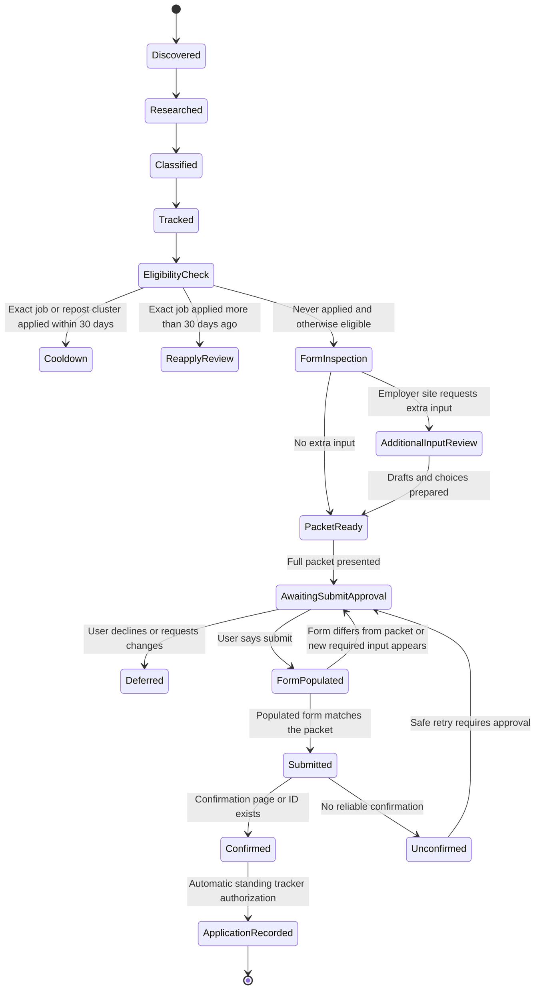
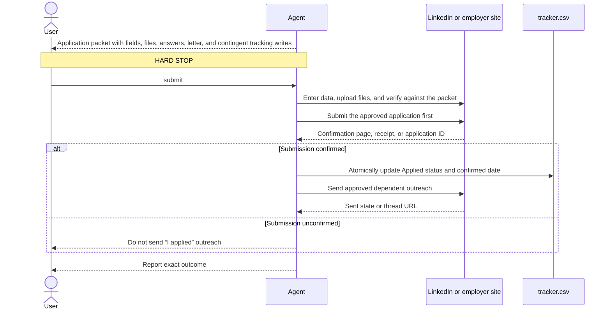

# Application preparation and submit approval

Read this file before inspecting an application flow or sending an application-related message.

## State model


```mermaid
stateDiagram-v2
    [*] --> Discovered
    Discovered --> Researched
    Researched --> Classified
    Classified --> Tracked
    Tracked --> EligibilityCheck
    EligibilityCheck --> Cooldown: Exact job or repost cluster applied within 30 days
    EligibilityCheck --> ReapplyReview: Exact job applied more than 30 days ago
    EligibilityCheck --> FormInspection: Never applied and otherwise eligible
    FormInspection --> AdditionalInputReview: Employer site requests extra input
    FormInspection --> PacketReady: No extra input
    AdditionalInputReview --> PacketReady: Drafts and choices prepared
    PacketReady --> AwaitingSubmitApproval: Full packet presented
    AwaitingSubmitApproval --> Deferred: User declines or requests changes
    AwaitingSubmitApproval --> FormPopulated: User says submit
    FormPopulated --> AwaitingSubmitApproval: Form differs from packet or new required input appears
    FormPopulated --> Submitted: Populated form matches the packet
    Submitted --> Confirmed: Confirmation page or ID exists
    Submitted --> Unconfirmed: No reliable confirmation
    Confirmed --> ApplicationRecorded: Automatic standing tracker authorization
    ApplicationRecorded --> [*]
    Unconfirmed --> AwaitingSubmitApproval: Safe retry requires approval
```

## Confirm eligibility first

Before preparing an application, read the live row and follow [discovery-tracking.md](discovery-tracking.md):

- Resolve the canonical LinkedIn URL and any repost relationship recorded in the private ledger or company Markdown.
- Verify the official posting is still open and materially matches the researched role.
- Exclude confirmed applications in the same repost cluster during the previous 30 calendar days.
- Never auto-reapply to an exact LinkedIn URL that has a `Last Applied` date. An older exact application requires a specific reapply decision.
- Reconcile any mismatch between LinkedIn's `Applied` badge and the tracker before continuing.

If a redirect opens a different role, stop and research and track the new identity before using this workflow.

## Inspect the form read-only

Open and inspect the named application form without asking for a separate approval when doing so is read-only and shares no applicant data. Inspect every visible step when possible. Do not click a control that itself saves an application, transmits applicant data, or creates a recruiter-visible signal; do it only after the user says `submit`.

## Prepare the application packet

Use the current research Markdown already referenced by the tracker row as the default source for the application packet. When that file contains usable company and role research, do not repeat a full research pass. Refresh only a missing, stale, contradictory, or decision-critical fact needed for the current application, then update the research file through the normal bounded-write workflow.

In the application packet, show:

- Company, role, location, job URL, job ID, posting date, and application channel.
- Company snapshot from the tracker-linked research file: a concise summary of what the company does, its website, and reported revenue. If revenue is not public or no reliable figure exists, state that explicitly instead of estimating it. Include brief funding or financial-health context when available.
- Concise role and company research with sources, salary evidence, interview expectations, and risk flags.
- Fit assessment: `A — Great Fit`, `B — Normal Fit`, `Investigate`, or `Skip`, with evidence-backed rationale, strongest evidence, gaps, hard constraints, and a recommendation.
- Exact provided PDF filename, absolute path, SHA-256 hash, page count, and modification time.
- Read-only role-alignment summary based only on the provided PDF: central qualifications evidenced, unsupported gaps, and any parsing problem that could affect this application. Do not propose or make resume changes.
- Every form field with the exact value to enter, and every file to upload.
- The full cover letter text with its PDF path, filename, page count, and SHA-256 when the form asks for or accepts one, prepared as described in [cover-letter.md](cover-letter.md).
- Proposed LinkedIn Premium actions, why they help, and any credit or quota they consume.
- Active account, relevant visibility mode, and exact execution order.
- Post-submit tracking preview: canonical LinkedIn URL, target CSV row, the exact fit-preserving `Status` such as `A — Great Fit · Applied`, and `Last Applied`. Use `${submitted_at}` only until the site confirms the real date.
- Known questions that require user input.

End the packet with one request: reply `submit` to enter everything shown and submit it, or request edits. The user may answer open questions, pick alternative drafts, or make edits in the same reply as `submit`; apply them exactly and submit. If an edit would change something the packet did not show, present that change first.

## Inspect and draft

After read-only form inspection, prepare all answers without entering or submitting them. Reuse verified user data only when its source and currentness are known. Show every exact submitted value in the application packet. Ask only for sensitive or uncertain facts that are not covered by the defaults below.

### User application defaults

These are user-confirmed facts and preferences. Apply them only when a field has the same meaning and scope. They reduce repeated questions but never replace the submit approval for a named role.

- For Germany-based roles, the user holds a permanent residence permit (`Niederlassungserlaubnis`) and does not need employer sponsorship now or in the future. Select that exact permit when offered; for simpler questions, answer `Yes` to ongoing German work authorization and `No` to sponsorship. Ask for other countries or materially different wording.
- The notice period is three months and may be negotiable with the current employer. Select `3 or more months` when the form uses ranges. For free text, use `3 months, potentially negotiable with my current employer` unless the user gives a role-specific answer.
- For Germany-based roles asking for desired annual compensation, use a minimum of `€100,000` gross. Enter `€100,000+ annual gross` for an open text range. When a required field asks for one exact number, enter `€110,000`, or `110000` in a numeric-only field. Ask when the role uses another currency or distinguishes base salary from total compensation.
- Derive the phone number, LinkedIn URL, and residence from the verified PDF resume when each value is unambiguous. Do not ask for them again, but repeat the exact values in the application packet.
- Answer hybrid-policy questions `Yes`. This does not establish willingness to relocate, accept a fully onsite role, or meet a specific non-hybrid commute requirement.
- To answer whether the user previously worked for or applied to the employer, compare the verified resume's employer history with the target company and its officially verified parent, affiliate, and former names. Answer `Yes` or `No` when the evidence is unambiguous; ask when company identity or ownership leaves a real ambiguity.
- The employer's default AI-assisted review is acceptable. Do not request a human-only opt-out unless the user asks.
- Agree to a data-processing consent only when it is required to consider the current application. Keep every optional consent unchecked, including future-opportunity retention, talent pools, marketing, notifications, and similar unrelated processing.

### Resume-first autofill order

After the user says `submit` and the form exposes the matching controls:

1. Upload the verified resume first and wait for the form's parser or autofill to finish.
2. Upload the cover letter PDF shown in the packet next when the form accepts one.
3. Inspect every populated field and reconcile it against the packet, the verified resume, and the user defaults above. Never trust parsed names, phone formatting, dates, locations, employers, or answers without checking them.
4. Enter every remaining packet value, then follow the submit steps below.

### Handle employer-site additional inputs

When LinkedIn redirects to an employer career site, or an employer site asks for input beyond verified contact details and the selected resume, inspect it before entering anything. This includes cover letters, motivation statements, experience summaries, role-specific questions, portfolio or writing-sample requests, additional documents, and optional free-text fields.

Inspect all visible pages or steps first when possible, then present the additional inputs together. For each input show:

- The exact field label, whether it is required, its format, and any character or file limits.
- Two or three materially different choices when useful. Put the recommended choice first and explain the tradeoff briefly.
- The exact optimal draft for every text choice, grounded in the verified resume, job description, and company research.
- Any unsupported claim, missing fact, or answer that requires the user rather than optimization.
- A `Leave blank` choice only when the field is optional and omitting it is reasonable.

Use this compact pattern:

```text
Field: Why do you want to join Acme? (required, 1,000 characters)

A — Tailored and specific (Recommended)
<exact draft>

B — Concise
<exact draft>

Default on submit: A. Reply B or revise: <instruction> to change it.
```

For a cover letter, read [cover-letter.md](cover-letter.md). It sets the full-letter default, style, and PDF workflow.

Keep every draft truthful and evidence-backed. Prefer concrete matching experience, why the role and company are relevant, and a short close. Do not invent metrics, responsibilities, relationships, or company knowledge. Outside the cover letter, do not invent enthusiasm; the cover letter's excited tone is the user's chosen style.

The `submit` reply may pick alternatives for individual fields; otherwise use the recommended choice for every field. It authorizes entering the listed content, uploading the listed files, and clicking submit for that named role only.

Every required field needs an answer from the user, a matching default, or the verified resume before submission. Never submit while a required field lacks one.

For sensitive or factual fields listed below, first use an exact matching user application default above. Otherwise do not recommend an answer merely to improve application odds. Show the available choices, identify what each means, and ask the user to supply or confirm the fact. If a later page reveals another substantive field, pause and repeat this process before continuing.

Outside those scoped defaults, do not infer:

- Work authorization or sponsorship needs.
- Salary expectations or current compensation.
- Willingness to relocate or commute.
- Notice period or availability.
- Demographic, disability, veteran, or criminal-history answers.
- Consent to future opportunities, marketing, automated screening, or talent pools.
- Legal or preferred name, pronouns, birth date, citizenship, nationality, address, phone, or email.
- Security clearance, background-check consent, conflicts, non-competes, references, or credentials.

Hand CAPTCHA, passkeys, two-factor authentication, and identity verification to the user. Do not bypass them.

## Use LinkedIn Premium deliberately

Check which features are actually visible in the current plan and region. Before visiting a named recruiter, manager, or employee profile, inspect LinkedIn’s profile-viewing mode. If the visit would identify the user, obtain approval either to make that visible visit or to switch to private mode. Use Premium features as follows:

- **Applicant and company insights:** prioritize and tailor; never treat a match score as a hiring verdict.
- **Top Applicant:** use as a lead, not proof of qualification.
- **Career Insights and Actively Hiring:** identify current demand and the most relevant recruiter or manager.
- **Network paths:** prefer a genuine warm introduction over cold outreach.
- **Top Choice:** propose it only for a truly high-priority, well-matched role; include the exact note in the approval packet.
- **InMail:** reserve it for a named, relevant recipient when no better route exists; include recipient, subject, body, credit cost, and remaining balance in the approval packet.
- **Who viewed the profile:** use as a private prioritization signal; never tell someone they were observed viewing the profile.
- **Interview practice and Learning:** close a demonstrated gap and rehearse role-specific stories; do not collect certificates as a substitute for evidence.

Draft messages that are short, specific, truthful, and easy to answer. Do not contact several people on one team with the same pitch. Do not send a follow-up without its own approval unless the user explicitly approved that exact follow-up in advance.

Any profile change, Open Profile setting change, company-interest signal, follow, connection request, InMail, referral request, or Top Choice selection is an external action. Show it and get approval first.

Do not add, replace, or delete resumes under LinkedIn `My qualifications`. That is resume management and belongs to `$resume-pilot`; the submit approval covers only attaching the already provided PDF to the named application when the packet lists that upload.

Do not start or change a subscription, trial, plan, or paid feature unless the user separately requests and approves it. Course enrollment, file upload, audio or video recording, and persistent interview-practice history also require approval before creation. If the user requests a recruiter specifically, do not silently substitute a manager or another recipient.

## Submit approval

The application packet is the only routine approval request. Before asking, make sure it shows:

- Every field, file, answer, recipient, and message, including the cover letter text and its PDF filename, page count, and SHA-256.
- The exact contingent tracker.csv update, including canonical LinkedIn URL, target row, `Status`, and `Last Applied`.
- That the scoped `Applied` and `Last Applied` tracking writes happen automatically, under standing authorization, only after reliable submission confirmation.

When the user says `submit`:

1. Enter the data and upload the files in the resume-first order above.
2. Re-read every populated field and attached file.
3. If everything matches the packet, click the final submit control right away.
4. If anything differs and cannot be corrected to the packet value, a required field is still empty, or a later step reveals new personal data, files, or substantive content, stop before submitting. Show only those items and wait for `submit` again.


```mermaid
sequenceDiagram
    actor U as User
    participant A as Agent
    participant S as LinkedIn or employer site
    participant C as tracker.csv
    A-->>U: Application packet with fields, files, answers, letter, and contingent tracking writes
    Note over A,U: HARD STOP
    U->>A: submit
    A->>S: Enter data, upload files, and verify against the packet
    A->>S: Submit the approved application first
    S-->>A: Confirmation page, receipt, or application ID
    alt Submission confirmed
        A->>C: Atomically update Applied status and confirmed date
        A->>S: Send approved dependent outreach
        S-->>A: Sent state or thread URL
    else Submission unconfirmed
        A-->>U: Do not send “I applied” outreach
    end
    A-->>U: Report exact outcome
```

The packet should be answerable with `submit` or requested edits. A `submit` reply covers only the named role and the packet shown for it; approval for another role never carries over.

Do not insert any other routine approval between the packet and submission. Ask again only for the exceptions in step 4 above.

If any final content differs from the presented packet, stop and ask again. Do not interpret silence, earlier interest, or a previous application approval as consent. Do not send an “I applied” message until submission is confirmed. If outreach delivery is ambiguous, report it and never retry without renewed approval.

## Verify outcome

Treat the application as submitted only when the site provides a reliable confirmation, receipt, or application ID. Record the channel and timestamp. If the page errors or the state is ambiguous, report the unconfirmed outcome and do not retry or mark `Applied` without approval.
