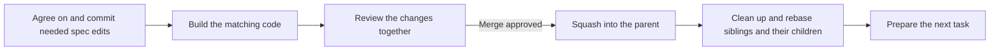
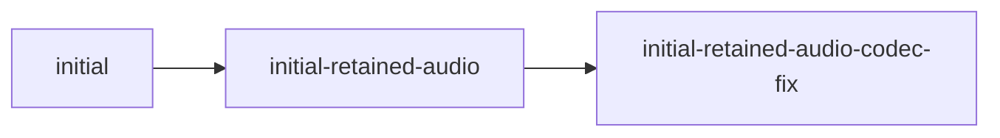
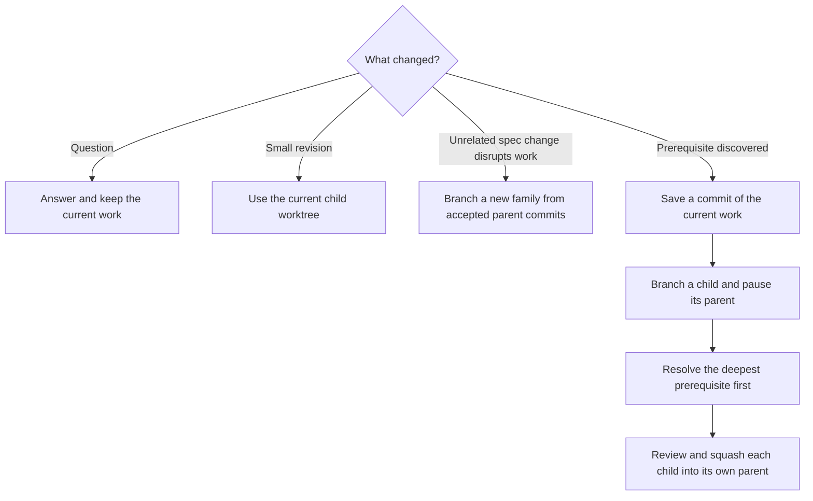

# Spec Workflow

Keep specs and code in agreement. Save interrupted work and prepare the next worktree for the user.



This skill chooses what to do next. [Git operations](references/git-operations.md) explains the commands and checks. [Guided Code Review](../guided-code-review/SKILL.md) handles the review conversation.

Read each repository or worktree's `CONTRIBUTING.md`, when present, before working there. Repeat this when switching worktrees.

## When to return to specs

Decide whether the requested change needs a spec decision before writing code.

| Change | What to do |
| --- | --- |
| New or unclear behavior, API rule, or shared domain term | Update the spec, glossary, or contract that defines it. Review and commit that decision before writing dependent code. |
| Build or fix behavior the spec already defines | Use the accepted spec version. No new spec edit is needed. |
| Local rename, proven dead code, internal restructuring, or an established internal bug | Code-only work is allowed if it needs no new product, contract, or domain decision. |

A local variable rename differs from renaming a shared domain concept. Aligning code with an existing spec term needs no new naming decision. Before calling code dead, check supported callers, configuration, contracts, and unfinished work.

If a spec is missing or unclear, show the relevant code, link the document that should define it, and propose a small wording change or clear options. Pause code that depends on that decision, including work in other affected branches. Independent, authorized cleanup may continue unless the user paused everything.

Do not change a spec just to justify existing code. Keep each requirement in the document that defines it. Preserve requirement IDs during wording changes, and record deferred work only when agreed.

## Write specs for readers

When writing or revising a spec, use familiar words and short sentences. Start with what the user sees or can do. Put distinct rules, conditions, and outcomes in separate bullets or short paragraphs. Use agreed domain terms consistently and explain unfamiliar terms.

Use a focused Mermaid diagram to clarify a workflow, sequence, state change, data flow, or relationship. Give actions and decisions simple labels. Keep exact, testable requirements in nearby prose and make sure the diagram agrees with them. Preserve the document's structure and requirement IDs. Before finishing, simplify any sentence that needs a second read.

## Map domain language into code

Use the names agreed in the spec or glossary throughout models, IDs, services, APIs, database mappings, storage, UI models, and tests. Preserve each concept's meaning, relationships, and rules as well as its name.

Choose familiar, concrete words for new concepts. If two names are equally accurate, use the easier one. Explain necessary specialist terms in the spec or glossary. Keep different concepts distinct. Agree on any change to an existing term in the spec before renaming it in code.

For example, a spec concept named **Class** could map to:

| Spec term | Code and APIs | Storage |
| --- | --- | --- |
| Class | `Class`, `ClassId`, `ClassRepository`, `ClassDto`, `classId` | ORM entity `Class`, table or collection `classes` |

Normal casing, plural forms, namespaces, and suffixes can follow project conventions. Do not introduce `Course` or `Session` as unexplained names for the same Class. Keep those names when the spec defines them as different concepts.

For concepts touched by the change, add a small mapping to the owning spec or glossary when useful: term → code symbol and path → API or storage name. Include key relationships. Explain differences required by a language, framework, third party, or older supported version.

Link to the existing definition instead of making another catalog. A noun does not always need its own entity or table. Avoid broad schema renames just to make spelling uniform. Explicitly scope any needed compatibility or migration work.

## Where should a worktree go?

A **change family** is one change across all relevant repositories. Each repository uses the same full branch name. A **parent** is the branch a child will merge back into; a **sibling** is another child of that parent.

Build the branch name from its ancestors, called its **lineage**:



The root uses `<change>`. Each child appends `-<change>` to its parent's full name. Keep worktree folders beside one another as `<repo>-<full-branch-name>`:

```text
workspace/
  specs-initial/
  backend-initial/
  specs-initial-retained-audio/
  backend-initial-retained-audio/
  frontend-initial-retained-audio/
```

Existing prefixes such as `001-initial` stay in the name. New roots need no category tag or number. A code-only change needs no empty spec branch; record why other repositories are unaffected.

Record exact repository paths, branches, parent branches, and parent commit IDs (SHAs). Names help navigation, but never determine merge or rebase targets by splitting a name.

Priority changes and new parent commits do not change names. If the actual parent changes, rename the family across its repositories before further review or merge. Follow [Git operations](references/git-operations.md#prepare-or-branch), including VS Code workspace updates.

After creating a worktree, add it to the existing root `.code-workspace` file and sort its folder paths as described in that reference.

Keep main and branches used to collect reviewed changes clean outside merge operations. Make spec and code edits in short-lived child worktrees.

## What if work is interrupted?



A saved commit, or **checkpoint**, preserves unfinished work so a prerequisite can build on it. Reviewing the child approves only what it changes relative to that parent commit. It does not approve the unfinished work it inherited.

If several branches share a prerequisite, or depend on each other in a cycle, settle where the work belongs before continuing. Do not merge across siblings or skip parents to bypass that decision.

## When can we merge and clean up?

1. For a change involving specs and code, accept the spec on its child branch first. Record that exact spec commit in each code repository's work record.
2. Before merging, check every required repository. Its change must be current, tested, and covered by approval, or have evidence that it is unaffected. Accepting a spec allows dependent implementation within scope; it does not approve the code or the merge.
3. Load [Guided Code Review](../guided-code-review/SKILL.md) in this conversation. Pass the repositories, exact parent/head/spec commits, and destination. Reuse a review only while its approval still covers those inputs.
4. Squash each child into its immediate parent as one commit. This also applies to the final release merge. Follow [Git operations](references/git-operations.md) for setup, checkpoints, merges, rebases, and cleanup.
5. A parent can return to its own parent, or be removed, only after all its children are resolved and cleaned up. This rule applies at every depth.
6. After a child merges and is cleaned up, rebase every remaining sibling, then its children, onto their updated immediate parents. Check the results before another dependent merge.

A clean rebase does not prove the code still matches the spec. Check changed requirements, APIs, and callers separately. Adapt code within accepted decisions and test it. If a conflict needs a new decision, leave the affected work blocked and explain the decision needed.

Repositories merge one at a time. Record each success so a retry does not repeat it. The family is complete only when all required merges or no-change checks, child cleanup, and sibling updates are done.

Keep a branch that collects a release until its planned changes are done or the user changes the scope. The final release needs separate approval and verified results on every required destination branch. Keep shared change names and result SHAs in the release record after squash and cleanup. Deployment and publication are separate actions.

## Which task comes next?

After an interruption, review decision, merge, cleanup, rebase, failure, or resumed session, compare the work record with Git. Choose the next action in this order:

1. Honor an explicit pause or a review waiting for the user. Save the review position if it is interrupted or its inputs change.
2. Finish any repairable partial merge, rebase, or spec/code update before more dependent work. If blocked, consider only unaffected, authorized tasks.
3. Follow the user's highest priority. Work on its deepest ready prerequisite first.
4. Resume interrupted work when ready; otherwise choose another ready task. Break ties by what unblocks the release, context already available, then a stable order. Branch names and discovery dates alone do not set priority.

Prepare that worktree and report its **change, repository, branch, absolute path, next action, and why it is next**. Open the relevant file or diff when possible. Continue coding only within the user's authorization; otherwise leave the worktree ready. Do not ask what comes next when recorded priorities already answer it.

Independent work can use many worktrees. Coordinate who writes to each one, and keep one review conversation active with the user.

## Keep one work record

Use the existing workspace ledger, normally `COMMIT_REVIEW_QUEUE.md`. A ledger is the current work record. Keep it outside the specs and implementation commits.

| Record | What to keep |
| --- | --- |
| Work map | Shared names, repositories and paths, parents, dependencies, priorities, interrupted work to resume, required and unaffected repositories |
| Versions and recovery | Parent/base/head/spec SHAs, saved tips and old replay boundaries, checkpoints, original-to-squash commit mappings, completed merge or rebase steps |
| Progress | Every child, each repository's state, spec/code agreement, checks, family and release completion, exact blockers |
| Review and next task | [Review record](../guided-code-review/SKILL.md#review-record), current review position, authorized action, next worktree and reason |

The old replay boundary is the saved parent commit that separates inherited work from a child's own commits. Keep it before any history rewrite; [Git operations](references/git-operations.md) uses it to avoid replaying work twice.

## Choose agents and reasoning effort

Keep coordination, user decisions, and the work record in the main conversation. Use project-defined agents and model choices. If the project gives model classes rather than names, choose by job:

| Job | Model class |
| --- | --- |
| Spec or domain decision | Strong judgment |
| Implementation or debugging | Strong coding |
| Simple lookup or extraction | Fast and low cost |

Give each agent a clear job, relevant repositories, accepted spec commit, worktree scope, decisions, and limits on what it may do. Verify what it returns. Delegate when project instructions call for it or a separate context materially helps; each agent adds token cost.

| Reasoning effort | Use when |
| --- | --- |
| Low | A small, repeatable lookup has an objective answer |
| Medium | The scope and expected result are clear |
| High | The work crosses components or needs careful checks of assumptions and edge cases |
| Extra High | A difficult decision, migration, recovery, or conflict has several plausible solutions and could affect much of the system |

Increase model capability or effort if the task grows or checks reveal unresolved uncertainty. Do not silently downgrade a required model. If a required agent or model is unavailable, preserve the work and report the limitation.

Settle the spec before dependent implementation. Run only independent jobs in parallel.

## Check accumulated differences with hard-sync

Run a broad spec/code comparison only when the user explicitly requests `hard-sync`. Read [Hard sync](references/hard-sync.md) for the full rules.

```text
$spec-workflow hard-sync
$spec-workflow hard-sync -b
```

These are prompt switches, not shell flags. Check both directions: what code lacks a spec, and what specs lack working code. Ask about undocumented features and wholly missing implementations. Repair confirmed wrong or partial implementations through the normal workflow.

`-b` allows scoped breaking changes. It does not approve removing features, deleting data, or merging. Keep the checked scope, decisions, and compatibility requirements in the work record. Ordinary work, questions, and skill edits do not activate hard-sync.

## Stay within the request

Questions and plans are read-only. Authorized workflow work includes scoped setup, checkpoints, required rebases, code adaptations within accepted decisions, work-record updates, and preparing the next worktree.

Merges, new product decisions, and external actions need the applicable authorization. Reuse authorization already given for the same action and scope. The review handoff is a skill instruction, not a Git hook or background monitor. Editing this skill does not run the workflow on live repositories or create new Codex tasks.
