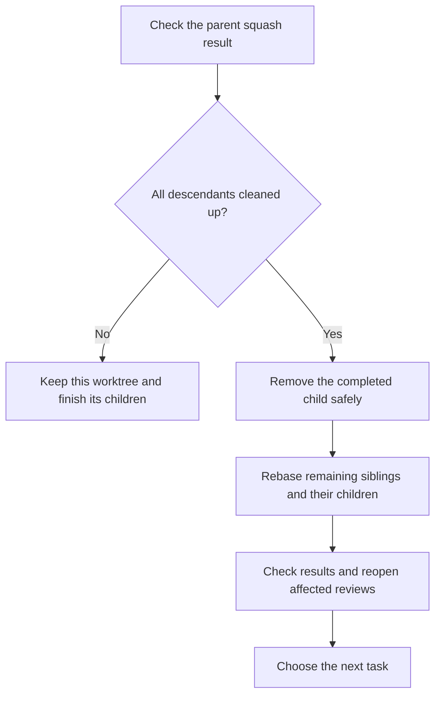
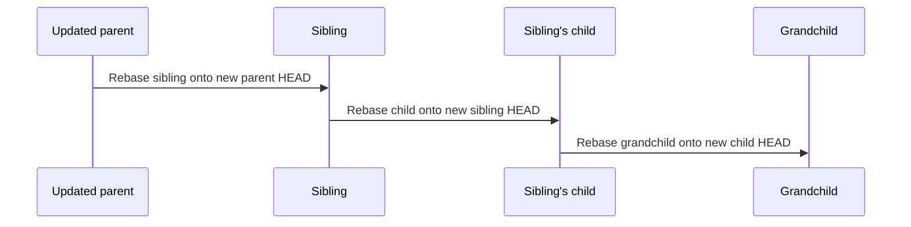

# Git operations

Use these steps for work selected by [Spec Workflow](../SKILL.md). Keep saved work recoverable and merge only the changes approved in [Guided Code Review](../../guided-code-review/SKILL.md).

## Prepare or branch

Read the repository instructions. Inspect worktrees, branches, HEADs, staged and unstaged edits, untracked files, and saved recovery references. Check the recorded paths and name collisions. Reuse the correct worktree; do not force a branch that is checked out elsewhere. The folder name alone does not prove which branch is its parent.

A root branch uses its change name. A child appends `-<change>` to its parent's full name. Use that same branch name in every relevant repository and put each worktree beside the others at `<repo>-<full-branch-name>`. Check branch and path lengths before creation. If a name is too long, choose one shared replacement across repositories.

On change branches, use `<full-branch-name>: <short description>` for commit subjects, including checkpoints. For example: `001-initial-class-recovery: Save recovery draft before rebase`. The worktree folder prefix (`<repo>-`) is not part of the subject. For a squash into a parent change branch, use the merged child's full change name, such as `001-initial-class-recovery: Add recovery rules` on `001-initial`; a commit made directly on `001-initial` uses `001-initial:`. For a squash merge into `main`, use a plain descriptive subject without a branch or repository prefix. If commit messages must be corrected later, preserve the old tips, verify unchanged trees, and update affected review SHAs; do not force-push as part of a local correction.

Before branching, verify the intended immediate parent against Git and the work record.

Choose the starting point:

| Kind of work | Starting point |
| --- | --- |
| Independent change | The accepted branch where reviewed changes are collected |
| Prerequisite of current work | A checkpoint commit of the current child's in-scope edits |

Include intended new files, renames, deletions, and executable bits in a checkpoint. Save the original staging information. Uncommitted files do not appear automatically in a new worktree. A child can inherit unfinished work, but its review does not approve that inherited work.

If main or another branch used to collect reviewed changes has uncommitted development edits, preserve and move them into the right child. Do not add a WIP commit to that parent just to make it clean. Keep unrelated user work recoverable on its own.

Git checkpoints do not save external databases, devices, or all ignored files. Preserve any specifically needed exceptions without copying credentials, caches, or build outputs wholesale.

### Copy the parent's local environment

After creating a worktree from a parent branch, use that repository's recorded parent worktree path. If its root `.env` exists and the new worktree has no `.env`, copy the file into the new worktree root and preserve its permissions. Skip a missing source and leave an existing destination unchanged, including on retries.

Keep the copied file excluded from Git using the repository's ignore rules or a local Git exclusion. Never print its contents, stage it, or include it in a checkpoint or implementation commit. Record only whether the copy was made or skipped. Other environment files are outside this automatic copy rule.

### Update VS Code

After creating a worktree, look for an existing `.code-workspace` file in the shared workspace root.

1. Use the active file if there are several. Ask which file to use only if the active one cannot be found. If no file exists, skip this step without creating one.
2. Add the worktree to `folders` with a path relative to that file. Compare resolved paths first to avoid duplicates.
3. After adding it, sort folder entries with a string `path` in ascending lexical order by that value. Keep display names and comments attached to their entries. Preserve other keys, formatting, and the relative order of entries without `path`. The file may contain JSON comments.
4. Validate the file and check that the new entry resolves to the created worktree.

### If the actual parent changes

A new parent commit or a priority change does not rename the worktree. A change to the actual parent branch does.

Pause writers and save the current state. Rename the branches consistently across the family, move worktrees with `git worktree move`, and update paths in the work record and `.code-workspace`. Check the result with `git worktree list --porcelain`.

Record which repositories were updated so a partial rename can resume safely. Reopen affected reviews when their recorded branch or path changes.

## Freeze the review inputs

Save the complete child change in a commit within the user's authorization. Record the exact parent baseline and child commit to review:

```text
git diff <parent-base-sha> <child-review-sha>
```

Check status so intended uncommitted or untracked files are not left out. Pass Guided Code Review the repositories, parent/head/spec SHAs, scope, checks, and destination. A checkpoint does not approve a merge. If the work is already committed, do not create an empty commit to mark it approved.

Before merging, verify:

- The [review record](../../guided-code-review/SKILL.md#review-record) covers the current inputs and destination.
- The parent is clean, and all children below the merging branch have been resolved and cleaned up.
- Every required repository is current, checked, and approved, or verified unaffected.

Unexpected changes to the parent, child, or spec invalidate affected approvals. Update and check the work, then review the changed version. Do not substitute a newer tip under an old approval.

## Squash into the immediate parent

A **squash merge** puts the child's approved changes into one new parent commit. Keep the parent's earlier history.

Save the child tip under a durable Git recovery reference so it stays reachable after cleanup. Pause other writers to the branches being merged. In the clean parent worktree, run:

```text
git merge --squash <approved-child-sha>
```

Inspect the staged result, then create **one** commit. Its only parent must be the recorded parent HEAD from before the merge. It must include the whole approved child change, including changes previously merged from its descendants. Do not fast-forward or copy the child's WIP commit history into the parent. If the approved diff is empty, record that no change was needed; do not create a dummy commit.

For a child based on the exact current parent, check that:

- The resulting tracked files match the reviewed child tree.
- The staged change was the approved change, and exactly one new commit was added.
- Relevant checks pass on the combined result.

Record the parent-before, original-child, and squash-result SHAs, what content was checked, and recovery references.

### Merge across repositories

Before starting, freeze all ready repositories' inputs and the merge order. Merge the spec first by default. Record each successful result immediately.

Squashing creates new commit IDs. Expected replacements of original commits by squash commits do not invalidate the remaining approvals in this batch when the approved content is verified unchanged. Unexpected changes to content or inputs do invalidate them.

A partly finished batch is still incomplete. When resuming, continue from the recorded results without repeating a successful squash.

If a squash fails, save its index, working files, and recovery points before resolving or restoring it. Do not assume `git merge --abort` can undo a squash. Review any materially different conflict resolution and check the result before dependent work continues.

## Clean the child, then refresh survivors



Remove a child only when its approved changes are verified in the parent, all its descendants are resolved and cleaned up, and no unique edits, untracked files, commits, or other needed files remain unaccounted for. Keep source and checkpoint history reachable through recorded recovery references.

A paused, blocked, or merged-but-not-cleaned child still prevents its parent from returning or being removed. Canceling or moving work elsewhere needs an authorized decision about its ownership and recovery. Never remove main as part of child cleanup.

Use `git worktree remove` and respect dirty state and locks. A squash usually leaves the original child tip outside the parent's ancestry. After proving its content is in the parent and retaining a recovery reference, a precisely targeted `git branch -D <completed-child>` may therefore be needed. Do not use branch deletion in place of those checks. Recovery-only references are not active child tasks.

### Rebase recursively, from parent to child

Rebase **every surviving sibling**, including paused or reviewing branches, in every affected repository. Then repeat for their children, at every depth.



Before the first rebase, save the old tips, old parent replay boundaries, and current edits for the **whole affected subtree**. An old replay boundary is the parent commit where that branch's own work began.

In each node's worktree, replay only its own commits:

```text
git rebase --onto <new-parent-head> <recorded-old-parent-base> <node-branch>
```

Update the sibling first, then its descendants onto their updated immediate parents. Do not guess a new merge base after rewriting history; that can replay inherited or already squashed changes. Inspect any unclear existing merge history before choosing what to replay.

After each rebase, confirm that the new parent HEAD is an ancestor of the child. Compare the old and new changes relative to their parents, using content checks and `range-diff` where helpful. Check that unique work survived without duplication. Check changed specs, APIs, callers, and relevant tests separately. New heads, bases, or spec inputs reopen affected reviews. This local workflow does not authorize force-pushing.

If a rebase or check fails, keep the stopped state and record completed and remaining steps. Do not skip commits, discard conflict evidence, or repeat completed work. Hold further dependent merges until the affected branches are updated and checked. Repair the failure or return unaffected, authorized work to the next-task selection.

## Recovery and verification

Before removing or replacing content, verify that saved copies can recover it. A successful command alone is not proof. When bringing in older work, inspect each source and restore only the intended changes against current decisions. Retain the sources until their content is verified elsewhere and their removal is authorized.

Stashes may supply older saved work; they are not part of the normal worktree flow. Honor an explicit instruction not to create checkpoint commits, and explain any dependent step this prevents.

Use checks that fit the change: focused behavior tests, relevant type/lint/build checks, and then affected paths through the combined system. Report what actually ran. Distinguish local checks, live services, and phone or device testing. Testing a child does not test all its inherited parent work, and a clean rebase does not prove spec agreement.

Record evidence when a repository is unaffected instead of creating an empty counterpart commit. Keep source/result SHAs and actual results for each repository through the final release merge and cleanup.
