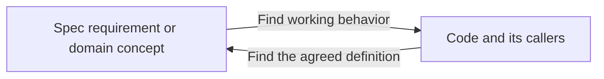
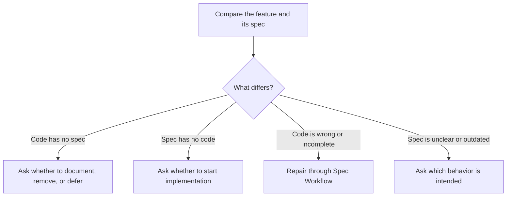

# Hard sync

Use hard-sync when the user asks to find and repair differences that have built up between specs and the project's own code. First inspect both, then settle decisions and repair the agreed changes.

```text
$spec-workflow hard-sync
$spec-workflow hard-sync -b
```

Normal mode keeps existing APIs and data compatible. `-b` permits scoped breaking changes for this run. An equivalent explicit request in plain language counts too. Record that scope once and keep it when resuming; it does not carry into other work or later runs.

An audit-only request allows findings, not repairs. Discussing or editing this mode does not start a sync.

## Compare specs and code in both directions

Identify the repositories, authoritative spec versions, and code branches and commits to compare. Account for relevant uncommitted work without resetting it. Keep the chosen implementation separate from alternate worktrees and older saved work. If the starting versions are unclear, settle that before claiming a mismatch.

Read every in-scope feature spec, contract, and domain definition. Separately inspect the project's code through entry points, callers, storage, configuration, and tests. Check both directions:



Do not limit the check to the current diff. A matching name or helper function does not prove a feature works through its real callers. Do not count vendor or generated code as undocumented product features.

Keep findings in the existing work record. For each one, record the requirement or code feature, evidence, current state, proposed action, API/data impact, user decision, and verification result. Track areas checked and areas still unknown. Group findings with one cause into a coherent change; do not open a worktree for every helper.

## Route each finding



| Finding | What to do |
| --- | --- |
| A feature or domain concept exists only in code | Show what it does, where it is used, its impact, and the missing spec. Ask whether to keep and document it, remove it, or defer. Do not add a spec or delete the code automatically. |
| An accepted spec has no implementation | Ask whether to start implementation through Spec Workflow. Planned or deferred requirements are not automatically repair work. |
| Code partly or wrongly implements a current accepted spec | The requested hard-sync run authorizes this repair through Spec Workflow. Do not ask again whether to invoke it. Still follow the breaking-change, review, and merge rules. |
| The spec is outdated, contradictory, or unclear | Ask which behavior or spec is authoritative before changing dependent code. Do not replace working behavior based on an uncertain target. |
| Internal helper, proven dead code, or code-only maintenance | Explain why no feature spec is needed. Perform cleanup only within the authorized scope. |
| Spec and code agree | Record the evidence and continue. No repair is needed. |

Handle one coherent decision at a time. Continue independent inspection while waiting, but leave undecided product choices alone. Reuse decisions already made. `-b` does not answer whether to remove an undocumented feature or implement a missing one.

For a feature the user wants to keep, revise, review, and commit its spec before dependent code changes. For approved removal, use Spec Workflow to define the affected callers, contracts, and data. Start a wholly missing feature only after the user chooses to implement it.

All repairs use the usual shared branches, reviews, squash merges, and recursive sibling updates.

### Where cleanup fits

[Cleanup](../../cleanup/SKILL.md) handles proven dead code and restructuring that preserves behavior. Missing documentation does not make code dead. Removing a live feature needs the user's decision and Spec Workflow; Cleanup may help remove leftovers once that scope is agreed.

## Breaking mode

Without `-b`, preserve public contracts and retained data. Use compatible changes and migrations where needed. If a repair cannot preserve compatibility, explain the concrete break and obtain permission for that part.

With `-b`, directly change API or event formats, domain or storage names, and schema definitions needed for the accepted sync work. Update all affected repositories, callers, fixtures, and tests together.

Skip compatibility layers and upgrade migrations only when the agreed scope is unreleased or a new installation, with no requirement to preserve old data or clients. Keep a reproducible way to create the fresh schema and run the project.

Use known release/data facts or the user's explicit statement to establish that scope. `-b` alone does not prove there are no deployments, clients, or valuable development data. If that matters and is unknown or contradicted by evidence, ask once about the concrete scope. Do not repeatedly ask about an already authorized break.

A direct breaking change can be delivered as one reviewed change and one squash commit per repository. Separate repositories cannot share one Git commit.

`-b` does not bypass spec decisions, feature-removal decisions, guided review, commit/merge approval, or final release approval. It does not permit database drops, resets, or deletion of retained data. Those need explicit permission for the target and data to discard.

## Verify and close

After each accepted repair, update the mappings and tests. Recheck findings affected by later spec or code edits.

Show remaining undocumented features, missing implementations, incomplete behavior, deferred decisions, and unchecked areas separately. Mark a finding resolved only with evidence for the version actually reviewed or merged. A deferred finding is still open. A passing helper test does not prove the complete feature works.

Finish only when the agreed scope is verified, or report clearly what remains open.
