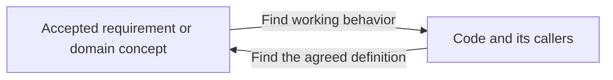
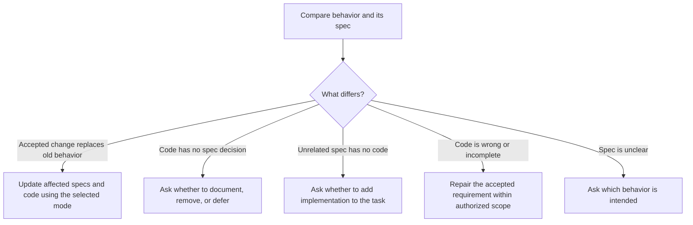

# Spec and code sync

Make affected code match the accepted spec, including its domain terms, APIs, storage, and behavior. This is part of the normal Spec Workflow cycle. A separate sync option is not needed.

Use the task's selected compatibility mode. Apply the same mode across every repository in the change family, and record the accepted spec commits, scope, decisions, and checks.

## Compatibility mode

Without `--not-live`, treat the task as live. Preserve supported API and event formats, client behavior, and retained data. Revise current specs while keeping the versioned contracts and decision history needed for supported behavior. Plan compatible transitions, deprecation, and upgrade migrations where needed. If a required change cannot preserve compatibility, explain the break and settle that decision before dependent implementation.

With `$spec-workflow --not-live`, the user selects direct replacement for the accepted task. Revise or remove specs, contracts, and decision records that the new decision clearly supersedes. Update incoming links, diagrams, and requirement references together. Retire replaced requirement IDs instead of assigning their old identity to a different rule. Git keeps the old text; do not keep a second active definition or an obsolete document solely to explain edit history.

After accepting the revised spec, update all affected first-party code, callers, schema definitions, fixtures, and tests to match. Remove code and old-client paths that exist only to support the superseded decision. Build missing behavior within the accepted task's implementation scope without asking again whether to invoke a separate sync workflow.

Skip old-client compatibility layers and upgrade migrations unless the user requires them. Keep fresh schema creation and setup reproducible. Current domain rules, retry safety, and retention behavior remain real requirements even before release; they are not automatically obsolete compatibility work.

`--not-live` expresses the user's choice for this task. Do not infer it from a branch name, repository guide, or known first-release status. If evidence contradicts the selected scope, such as a supported deployed client that would break, pause the affected part and settle that concrete compatibility conflict with the user. Do not ask again merely because an accepted replacement is breaking.

The flag does not select unrelated feature removals or resolve unclear requirements. Deleting stored data, resetting databases, or removing deployed resources needs explicit permission for that target. Reviews, commits, and merges keep their normal authorization boundaries.

Both modes include spec-to-code alignment within the accepted task. Honor a narrower request for planning, docs-only work, or an audit-only report. Record the mode and keep it through resumptions of that task; a new task defaults to live.

## Audit existing differences when asked

A whole-project audit starts only when the user asks to compare existing specs and code broadly. `--not-live` alone does not start that audit or widen the feature scope. An audit-only request allows findings, not repairs.

Identify the repositories, authoritative spec versions, and code branches and commits to compare. Account for relevant uncommitted work without resetting it. Keep the chosen implementation separate from alternate worktrees and older saved work. Settle unclear starting versions before claiming a mismatch.

Read every in-scope feature spec, contract, and domain definition. Separately inspect the project's code through entry points, callers, storage, configuration, and tests. Check both directions:

Do not limit the check to the current diff. A matching name or helper function does not prove a feature works through its real callers. Do not count vendor or generated code as undocumented product features.

Keep findings in the existing work record. Record the requirement or code feature, evidence, current state, proposed action, API/data impact, user decision, and verification result. Track areas checked and areas still unknown. Group findings with one cause into a coherent change; do not open a worktree for every helper.

## Route each finding

| Finding | What to do |
| --- | --- |
| A definition or implementation is clearly superseded by an accepted task decision | Apply the selected mode. With `--not-live`, replace or remove the old active definition and its code directly. With the live default, preserve required compatibility and plan the transition. Do not ask again about the same accepted replacement. |
| A feature or domain concept exists only in code, with no accepted decision about it | Show what it does, its usage and impact, and the missing spec. Ask whether to keep and document it, remove it, or defer. |
| A spec has no implementation outside the accepted task | Ask whether to include its implementation. Planned or deferred requirements are not automatically new work. |
| Code partly or wrongly implements an accepted spec | An authorized sync/repair task includes correcting it through Spec Workflow. Use the accepted requirement and selected compatibility mode. |
| The spec is outdated, contradictory, or unclear and no accepted replacement settles it | Ask which behavior or spec is authoritative before changing dependent code. |
| Internal helper, proven dead code, or code-only maintenance | Explain why no feature spec is needed. Perform cleanup only within the authorized scope. |
| Spec and code agree | Record the evidence and continue. |

Handle one coherent decision at a time. Continue independent inspection while waiting, but leave undecided product choices alone. Reuse decisions already made.

For a feature the user wants to keep, revise, review, and commit its spec before dependent code changes. For approved removal, define the affected callers, contracts, and data. Start a wholly missing feature only when its implementation is within the accepted task scope.

All repairs use the usual shared branches, guided reviews, one squash commit per repository, and recursive sibling updates. Separate repositories cannot share one Git commit.

### Where cleanup fits

[Cleanup](../../cleanup/SKILL.md) handles proven dead code and restructuring that preserves behavior. Missing documentation does not make code dead. Removing a feature needs an accepted decision; Cleanup can help remove leftovers once that scope is agreed.

## Verify and close

After each accepted repair, update the mappings and tests. Recheck findings affected by later spec or code edits.

Show remaining undocumented features, missing implementations, incomplete behavior, deferred decisions, and unchecked areas separately. Mark a finding resolved only with evidence for the version actually reviewed or merged. A deferred finding is still open. A passing helper test does not prove the complete feature works.

Finish only when the agreed scope is verified, or report clearly what remains open.
